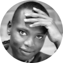
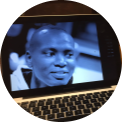
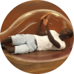

# Hi ✋ everyone

## My Self

 
 

My name is **Galal KORO**. my nick name is Shartai. I was born in Sudan on 9th
of October,1998. I’m interested in computer science.

`Never give up your dreams, if you are already half way and then you have many difficulties get over them. Only with your studies you will feel fulfilled.`

### Thing I should tell my self

- I am responsible for my own happiness.
- I profoundly and deeply accept myself.
- I have realistic expectations of myself.
- My opinion of me is more important than others' opinion of me.

#### _Education_

- [x] Three year of **_Secondary School_** attended in Sudan.
- [x] Attended one year **_University of Nyala_** in Sudan.
- [x] Six week of **Digital-sprint** in Antwerpen by **BeCode**

##### **IT Background knowledge's**

**Operating System**  
 

**Network**

---

###### **_My table_**

| language's Skills | Level    | Hobbies  | A Fun    | program    | logo                                                                                                                                              |
| ----------------- | -------- | -------- | -------- | ---------- | ------------------------------------------------------------------------------------------------------------------------------------------------- |
| Arabic            | **\*\*** | Reading  | \*\*\*   | HTML       |                                              |
| English           | **\***   | Fitness  | \*\*\*\* | CSS        |                                                                   |
| Dutch             | \*\*\*\* | Swimming | **\***   | JavaScript |  |
| French            | \*\*\*   | Football | **\*\*** | NodeJs     |                                            |
